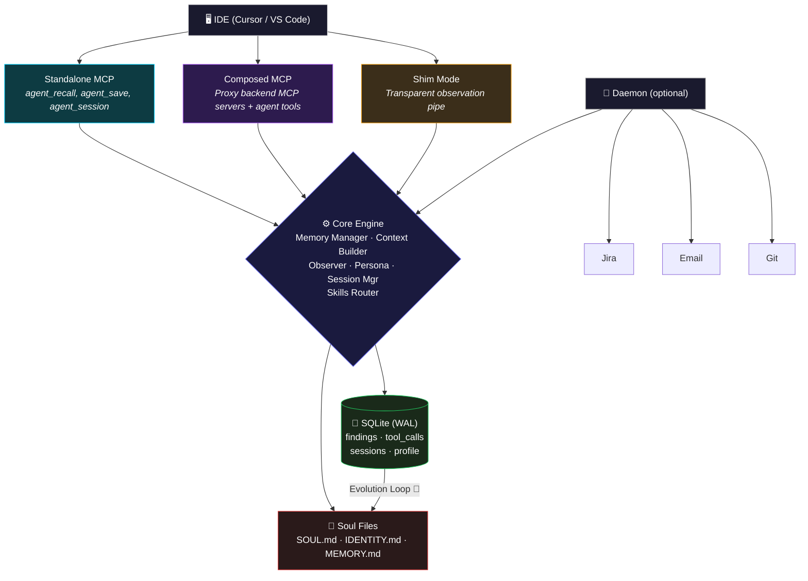

<p align="center">
  <h1 align="center">🧠 memcp</h1>
  <p align="center">
    <strong>Persistent memory for AI coding agents, built on MCP</strong>
  </p>
  <p align="center">
    <a href="https://github.com/sivakumar455/memcp/blob/main/LICENSE"></a>
    <a href="https://go.dev/"></a>
    <a href="https://modelcontextprotocol.io/"></a>
    <a href="https://github.com/sivakumar455/memcp/blob/main/CONTRIBUTING.md"></a>
  </p>
</p>

---

**memcp** is a persistent memory layer for AI coding assistants, built as an [MCP (Model Context Protocol)](https://modelcontextprotocol.io/) server. It gives LLM agents the ability to remember findings, evolve their persona, and build domain expertise across chat sessions.

> **🚧 Work in Progress** — Core functionality is implemented. Contributions, feedback, and ideas are welcome!

## Architecture



## ✨ Features

| Feature | Description |
|---------|-------------|
| **Hybrid Semantic Memory** | Save and recall findings using **Ollama Vector Embeddings** and pure-Go Cosine Similarity (fallback to FTS5) |
| **Soul / Persona System** | Three-file persona (`SOUL.md`, `IDENTITY.md`, `MEMORY.md`) that evolves as the agent works |
| **ADD / UPDATE / NOOP Pipeline** | Smart deduplication — new facts are added, existing facts are merged, redundant facts are skipped |
| **Credential Sanitization** | Passwords, tokens, and secrets are auto-redacted before storage |
| **Tiered Context Recall** | Budget-aware context assembly from persona, working memory, findings, and history |
| **Session Management** | Organize work into named sessions |
| **Observer System** | Transparent fact extraction from tool calls (environments, errors, trace IDs) |
| **Evolution System** | Automatically distills findings into learned patterns in persona files |
| **Domain Skills** | Pluggable skill files that partition memory by domain with independent evolution |
| **Background Daemon** | Optional task queue polling external services (Jira, email, Git) |
| **Three Operating Modes** | Standalone, Composed (proxy backends), or Shim (transparent observation) |

## 🚀 Quick Start

### Prerequisites

- **Go 1.25+**
- An MCP-compatible IDE (e.g., [Cursor](https://cursor.sh/), VS Code)
- **[Ollama](https://ollama.com/)** (Optional, but highly recommended for Semantic Vector Search)

### Build

```bash
git clone https://github.com/sivakumar455/memcp.git
cd memcp
make build
```

### Register as MCP Server

Add to your IDE's MCP configuration:

```json
{
  "mcpServers": {
    "memcp": {
      "command": "/path/to/memcp",
      "env": { "MEMCP_CONFIG": "standalone" }
    }
  }
}
```

## 🔧 MCP Tools

| Tool | Description |
|------|-------------|
| `agent_recall` | Recall context from persistent memory (call **first** every conversation) |
| `agent_save` | Save a finding to persistent memory |
| `agent_session` | Manage chat sessions (list, create, switch) |

### Example Usage

```
# Agent recalls context at start of conversation
agent_recall(query="timeout certificate staging")

# Agent saves a discovery
agent_save(key="service-x-rootcause", content="Root cause: expired certificate", tags="rootcause,timeout", importance=2)

# Agent manages sessions
agent_session(operation="create", name="PROJ-1234-investigation")
```

## 🏗️ Operating Modes

### Mode 1: Standalone MCP

Standard MCP server over stdio. Provides `agent_*` tools alongside other MCP servers registered independently.

### Mode 2: Composed MCP

Spawns backend MCP servers as subprocesses and proxies their tools. Every tool call is automatically observed — facts are extracted and persisted.

```json
{
  "mcpServers": {
    "memcp": {
      "command": "/path/to/memcp",
      "env": { "MEMCP_CONFIG": "composed" }
    }
  }
}
```

### Mode 3: Shim (Transparent Observation)

Acts as a transparent stdio pipe between IDE and any backend MCP server. Observes all tool calls without altering behavior.

```json
{
  "mcpServers": {
    "my-backend": {
      "command": "/path/to/memcp",
      "args": ["--shim", "--name", "my-backend", "--", "/path/to/backend-mcp", "--stdio"]
    }
  }
}
```

### Daemon Add-On

Enable background polling with `--daemon` flag or `MEMCP_DAEMON=true`. Works with any mode.

## 🧬 The Soul System

memcp's persona system uses three markdown files that define and evolve the agent's identity:

```
soul/
├── SOUL.md       ← Immutable core personality (you control this)
├── IDENTITY.md   ← Domain knowledge + auto-generated "Learned Patterns"
└── MEMORY.md     ← Accumulated findings with progressive summarization
```

- **SOUL.md** — Never modified by the system. Defines behavior, boundaries, and working style.
- **IDENTITY.md** — Contains your domain knowledge plus a `## Learned Patterns` section that auto-updates.
- **MEMORY.md** — Entirely managed by evolution. Findings are organized by age (active → recent → archived).

## ⚙️ Configuration

Configuration is loaded from `configs/standalone.yaml`. Override with environment variables:

| Env Var | Description |
|---------|-------------|
| `MEMCP_CONFIG` | Config file name (default: `standalone`) |
| `MEMCP_DATA_DIR` | Data directory for DB, soul files, logs |
| `MEMCP_LOG_LEVEL` | Log level: `debug`, `info`, `warn`, `error` |

## 📂 Project Structure

```
memcp/
├── main.go                    # Entry point (Cobra CLI)
├── Makefile                   # Build targets
├── configs/
│   └── standalone.yaml        # Default config
├── soul/                      # Persona files
│   ├── SOUL.md                # Immutable core personality
│   ├── IDENTITY.md            # Evolving domain knowledge
│   └── MEMORY.md              # Auto-populated findings
├── internal/
│   ├── config/                # Configuration loading
│   ├── engine/                # Core orchestrator
│   ├── memory/                # SQLite store (CRUD, FTS5)
│   ├── mcp/                   # MCP server + tool handlers
│   ├── session/               # Session lifecycle
│   ├── persona/               # Soul/persona file loader
│   ├── observation/           # Tool call observer
│   ├── evolution/             # Soul evolution system
│   ├── skills/                # Domain skill routing
│   ├── daemon/                # Background task queue
│   ├── gateway/               # HTTP gateway server
│   ├── shim/                  # Transparent observation proxy
│   └── logger/                # Structured logging
├── docs/                      # Architecture documentation
└── data/                      # Auto-created at runtime
    └── memory.db              # SQLite database
```

## 🤝 Contributing

Contributions are welcome! See [CONTRIBUTING.md](CONTRIBUTING.md) for guidelines.

Areas where help is especially appreciated:
- **Testing** — Unit and integration tests
- **Daemon Watchers** — GitHub Issues, Slack, etc.
- **New Skill Domains** — Skill files for common dev domains
- **Cross-platform** — Testing on Windows and Linux

## 📄 License

This project is licensed under the [MIT License](LICENSE).

---

<p align="center">
  <sub>Built with ❤️ for the MCP ecosystem</sub>
</p>
